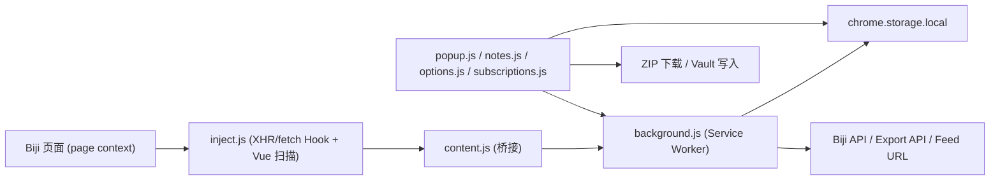

# GET笔记超级助手 项目说明书（AI 分析版）

> 目标：为后续让 AI 做代码分析、架构诊断、升级规划、性能优化提供完整上下文。  
> 项目类型：Chrome/Chromium 浏览器扩展（Manifest V3）  
> 文档更新时间：2026-03-01  
> 仓库路径：`/Volumes/home/Drive/vibe-code/biji-obsidian`

---

## 1. 项目概览

### 1.1 项目名称
- `GET笔记超级助手`

### 1.2 核心定位
- 把 `biji.com` 笔记数据抓取到扩展本地缓存。
- 支持多格式导出（MD/PDF/DOCX）。
- 支持两种导出目标：ZIP 下载、直接写入 Obsidian Vault。
- 支持订阅源（RSS/Atom/YouTube/B 站/播客）自动更新并提交到 biji。
- 支持在 YouTube/B 站/小宇宙页面注入“Get笔记”按钮一键提交链接。

### 1.3 版本与形态
- 当前版本：`1.0.0`（`manifest.json`）
- 构建形态：**无打包工具、无 npm 运行时依赖管理**，以静态 JS/HTML/CSS + 预打包第三方库形式直接运行。

---

## 2. 目标用户与典型场景

### 2.1 目标用户
- 使用 Get 笔记（biji.com）沉淀内容，同时在 Obsidian 二次整理的人群。
- 关注内容订阅自动化（视频/播客更新跟踪）的人群。

### 2.2 典型使用流程
1. 用户登录 `biji.com` 并浏览笔记页面。
2. 扩展自动捕获 API 请求头（认证信息）与部分笔记数据。
3. 用户在弹窗点击“获取全部笔记”触发全量分页抓取。
4. 用户选择导出格式（MD/PDF/DOCX）和导出方式（ZIP/Vault）。
5. 用户导出到本地或直接写入 Obsidian Vault。
6. 用户可配置订阅源与自动检查，持续把新内容提交到 Get 笔记。

---

## 3. 技术栈与运行环境

### 3.1 平台与标准
- 浏览器扩展：Manifest V3
- 背景脚本：Service Worker（`background.js`）
- 页面脚本：原生 JavaScript（IIFE 模式）
- 存储：`chrome.storage.local` + `IndexedDB`（仅存目录句柄）
- 文件系统：File System Access API（仅 Chromium 可用）

### 3.2 第三方库（直接内置到 `lib/`）
- `JSZip 3.10.1`：ZIP 打包
- `FileSaver.js`：浏览器下载
- `html2pdf.js`：本地 PDF 生成
- `docx.js`：本地 DOCX 生成
- 版本来源：`lib/VERSIONS.md`

---

## 4. 扩展权限与安全边界

### 4.1 权限（manifest）
- `storage`：设置、缓存、导出记录、订阅状态
- `cookies`：辅助登录态请求
- `alarms`：订阅定时检查

### 4.2 域权限
- 固定 host 权限（核心域名 + 内容平台）
  - `biji.com` / `*.biji.com`
  - `get-notes.luojilab.com` / `*.luojilab.com`
  - `*.umiwi.com`
  - `www.youtube.com`
  - `www.bilibili.com`
  - `www.xiaoyuzhoufm.com`
- 可选权限：`<all_urls>`（用于订阅源动态请求授权）

### 4.3 权限策略亮点
- 订阅源请求采用“按源申请 host permission”的方式，不默认拥有全部站点权限。
- Service Worker 对 header 做白名单过滤后才缓存，降低敏感信息面。

---

## 5. 目录结构与模块职责

## 5.1 顶层文件职责

| 文件 | 角色 | 说明 |
|---|---|---|
| `manifest.json` | 扩展声明 | 权限、入口、content script、页面 |
| `background.js` | 后台核心 | 消息路由、抓取、导出 API、订阅管理、告警任务 |
| `content.js` | 桥接脚本 | 注入 `inject.js`，连接页面上下文与扩展上下文 |
| `inject.js` | 页面上下文钩子 | Hook XHR/fetch、扫描 Vue 状态、抓 transcript |
| `content-inject-btn.js` | 站外按钮注入 | 在视频/播客页面注入提交按钮 |
| `popup.js` | 弹窗主逻辑 | 抓取、导出、订阅快捷管理 |
| `notes.js` | 笔记管理页 | 搜索筛选分页、批量导出 |
| `options.js` | 设置页 | 导出规则、性能、订阅配置、自动保存 |
| `subscriptions.js` | 订阅管理页 | 订阅 CRUD、筛选、分页、批量提交 |

## 5.2 页面文件
- `popup.html`：弹窗（导出 + 订阅快捷页签）
- `options.html`：设置页（导出、内容格式、性能、注入、订阅、高级）
- `notes.html`：笔记管理页
- `subscriptions.html`：订阅管理页
- `welcome.html`：欢迎页
- `help.html`：帮助文档页

---

## 6. 核心架构与数据流

## 6.1 总体架构（逻辑视图）



## 6.2 关键链路 1：认证头捕获
1. 用户在 `biji.com` 浏览触发网络请求。
2. `inject.js` Hook XHR/fetch 捕获请求头。
3. 通过 `content.js` -> `background.js` 发送 `apiHeaders` 消息。
4. 后台白名单过滤头字段并写入 `chrome.storage.local.apiHeaders`。

## 6.3 关键链路 2：笔记数据获取
- 自动来源：Hook 网络响应 + Vue store 扫描。
- 手动来源：弹窗 “获取全部笔记” -> 后台分页 API 抓取。
- 后台统一 `normalizeNote` 后入库 `notes`。

## 6.4 关键链路 3：导出
- 导出入口：弹窗/笔记管理页。
- 导出前补全：缺失正文 `fetchContent`，缺失 transcript `fetchTranscript`。
- 输出分支：
  - ZIP：JSZip 打包并下载。
  - Vault：File System Access API 直写目录。

## 6.5 关键链路 4：订阅自动化
- 订阅源保存在 `feeds`。
- `alarms` 定时触发 `checkAllFeeds`。
- 拉取 RSS/Atom -> 解析条目 -> 新条目标记/提交。
- 自动提交时调用 `submitLink` 进入 biji 处理链。

---

## 7. 主要模块详细说明

## 7.1 `background.js`（核心后端）

### 7.1.1 模块职责
- 统一消息路由（`routes`）
- 笔记抓取与分页拉取（`fetchAllNotes`）
- 内容/转录补全（`fetchNoteContent` / `fetchNoteTranscript`）
- 服务端 PDF/DOCX 导出任务管理（创建 + 轮询）
- 订阅源管理（CRUD、刷新、提交、OPML 导入、YouTube URL 转换）
- 定时任务（alarms）
- 数据存储与徽标更新

### 7.1.2 消息路由（`routes`）

| 类型 | 功能 |
|---|---|
| `notes` | 存储捕获笔记 |
| `discovery` | 存储调试发现日志 |
| `getNotes` / `getNotesMeta` / `getNotesByIds` | 查询笔记 |
| `clearNotes` / `clearDiscovery` | 清理数据 |
| `storeVueNotes` | 合并更新笔记 |
| `apiHeaders` | 存储认证头 |
| `fetchTranscript` / `fetchContent` | 补全转录/正文 |
| `exportNote` | 服务端导出单笔记（PDF/DOCX） |
| `fetchAll` / `cancelFetch` | 全量抓取控制 |
| `submitLink` / `isLinkSubmitted` / `getSubmissionHistory` | 链接提交与历史 |
| `checkAuth` | 认证状态预检查（返回 `authenticated` 布尔值） |
| `getFeeds` / `addFeed` / `removeFeed` / `toggleFeed` / `editFeed` | 订阅源管理 |
| `checkFeedsNow` / `refreshAllFeedItems` / `refreshFeedItems` | 订阅刷新 |
| `getFeedItems` / `submitFeedItems` | 条目查询与批量提交 |
| `importFeedsOpml` / `convertYoutubeUrl` | OPML 与 YouTube 处理 |
| `getPendingTags` | 读取待回写标签 |

### 7.1.3 订阅条目状态机
- `new`：新发现未提交
- `submitting`：提交中
- `submitted`：提交成功
- `noted`：已记录（兼容状态）

### 7.1.4 状态校正（`syncFeedItemStatuses`）
- 在 `refreshAllFeedItems` 完成后自动调用
- 已提交索引中有记录但状态不是 `submitted` → 校正为 `submitted`
- 状态卡在 `submitting` 但不在已提交索引中 → 恢复为 `new`
- 返回 `{ corrected: N }`，刷新按钮会显示校正数

### 7.1.5 定时任务
- Alarm 名：`biji-feed-check`
- 触发条件：`settings.feedAutoCheck = true`
- 周期：`settings.feedCheckInterval` 分钟

### 7.1.6 关键防护
- header 白名单过滤（`authorization/cookie/token/...`）
- 请求重试、指数退避、限流等待
- 订阅抓取超时（15 秒）与错误缓存（`feed.lastError`）

---

## 7.2 `inject.js` + `content.js`（采集与桥接）

### 7.2.1 `inject.js`（页面上下文）
- Hook `XMLHttpRequest` 与 `fetch`，提取 API 请求头与响应数据。
- 自动识别并规范化笔记数组（`findNotesArray` + `normalizeNote`）。
- 支持 Vue2/Vue3/Pinia/Vuex 多路径状态扫描。
- 支持 transcript 兜底抓取：`https://www.biji.com/note/{id}/web`（解析 SSR 状态与 DOM）。

### 7.2.2 `content.js`（扩展上下文）
- 将 `inject.js` 注入页面。
- 监听 `biji-ext-*` 自定义事件并转为 `chrome.runtime.sendMessage`。
- 响应弹窗指令：
  - `scanVueStore`
  - `fetchTranscript`（通过页面事件返回结果）

### 7.2.3 页面事件协议
- `biji-ext-data`
- `biji-ext-scan-request` / `biji-ext-scan-result`
- `biji-ext-fetch-transcript` / `biji-ext-transcript-result`

---

## 7.3 导出引擎（`popup.js` / `notes.js`）

> 两个文件都内嵌了大段共用实现（MD/PDF/DOCX/ExportEngine/VaultWriter），存在明显重复。

### 7.3.1 Markdown 导出
- 统一 Frontmatter 生成（字段可配置）
- 支持 HTML->Markdown 简化转换
- 支持语音断句、图片处理、音频链接追加

### 7.3.2 PDF 导出策略
- 优先服务端导出（普通模式）
- 失败回退本地渲染（`html2pdf`）
- `transcriptMode=merged` 强制本地渲染（保证正文+转录完整）
- Canvas 渲染有空白页检测（防止“导出成功但内容空白”）

### 7.3.3 DOCX 导出策略
- 优先服务端导出（普通模式）
- 失败回退本地 `docx.js` 生成
- `merged` 模式优先本地生成，确保含 transcript

### 7.3.4 ZIP 导出
- 根目录固定 `biji-export/`
- 并发处理单笔记导出任务
- 单笔记某格式失败时回退写入 `.md`
- 结束后写入导出记录（`exportedIds`）

### 7.3.5 Vault 直写
- 用目录句柄写文件
- 句柄持久化到 IndexedDB
- 可恢复句柄并二次授权
- 可配置子目录（默认 `biji-notes`）

---

## 7.4 订阅模块（`background.js` + `subscriptions.js` + `options.js`）

### 7.4.1 Feed 支持
- RSS 2.0 / Atom（正则解析，不依赖 DOMParser）
- OPML 批量导入
- YouTube 频道 URL/Handle 转 feed URL 转换

### 7.4.2 订阅管理能力
- 添加/删除/启停订阅源
- 手动刷新全部或单源（刷新后自动校正状态不一致的条目）
- 全文筛选（关键字、类型、状态、日期）
- 批量提交选中条目（提交前预检查认证状态，未登录时 Toast 提示）
- Toast 通知：提交失败、未认证等场景显示红色固定提示

### 7.4.3 数据规模控制
- `feedItems` 最大约 `10000`（优先清理 `submitted/noted` 旧项）
- `feedSubmittedItems` 最大约 `5000`

---

## 7.5 链接注入模块（`content-inject-btn.js`）

### 7.5.1 站点支持
- YouTube 视频页
- Bilibili 视频/番剧页
- 小宇宙单集页

### 7.5.2 行为
- 识别标题区域注入”Get笔记”按钮
- 可按平台开关启停
- 提交前检查是否已提交（防重复）
- 注入时预检查认证状态：未登录时按钮显示”请先登录biji”，点击打开 biji.com 引导登录
- 自动监听 SPA 路由变化重新注入

### 7.5.3 提交内容
- `url`、`title`
- 自动标签：平台类型 + 频道/播客名

---

## 8. 数据模型与存储结构（AI 重点）

## 8.1 `chrome.storage.local` 键清单

| 键名 | 类型 | 说明 |
|---|---|---|
| `settings` | object | 全局设置 |
| `notes` | object map | 笔记缓存，`{ [id]: note }` |
| `apiHeaders` | object | 过滤后的认证请求头 |
| `discoveryLogs` | array | 调试日志（最多约100） |
| `exportedIds` | array | 已导出笔记 ID 列表 |
| `lastExportTime` | string | 最后导出时间 |
| `submittedLinks` | array | 外链提交历史（最多约500） |
| `pendingTags` | object map | 待回写标签，键为 noteId |
| `feeds` | array | 订阅源配置 |
| `feedItems` | object map | 订阅条目缓存，键为 guid/url |
| `feedSubmittedItems` | object map | 已提交条目索引 |
| `discoveryMode` | boolean | 调试开关 |

## 8.2 `settings` 默认值（关键）

```json
{
  "filenameTemplate": "{date}-{title}",
  "dateFormat": "YYYY-MM-DD",
  "transcriptMode": "none",
  "folderMode": "flat",
  "frontmatterFields": {
    "title": true,
    "created": true,
    "modified": true,
    "source": true,
    "type": true,
    "tags": true,
    "biji_id": true,
    "exported": true
  },
  "imageFormat": "link",
  "includeAudioLink": true,
  "includeImages": true,
  "voiceSentenceSplit": true,
  "tagPrefix": "#",
  "exportMode": "zip",
  "vaultSubfolder": "biji-notes",
  "contentFetchConcurrency": 5,
  "transcriptFetchConcurrency": 5,
  "zipExportConcurrencyLight": 6,
  "zipExportConcurrencyHeavy": 2,
  "vaultWriteConcurrency": 4,
  "discoveryMode": false,
  "fetchDelay": 500,
  "scanDepth": 10,
  "enableInjectBtn": true,
  "injectBtnYoutube": true,
  "injectBtnBilibili": true,
  "injectBtnXiaoyuzhou": true,
  "feedAutoCheck": false,
  "feedCheckInterval": 60,
  "feedAutoSubmit": true
}
```

## 8.3 核心实体结构

### 8.3.1 Note（规范化后）

```ts
type Note = {
  id: string
  title: string
  content: string
  rawTranscript: string | null
  createdAt: string | number
  updatedAt: string | number
  tags: Array<string | {name?: string; label?: string}>
  noteType: string | null
  type: string
  audioUrl: string | null
  images: Array<string | {url?: string; src?: string}>
}
```

### 8.3.2 Feed

```ts
type Feed = {
  id: string
  url: string
  name: string
  enabled: boolean
  addedAt: string
  lastChecked: string | null
  type: "youtube" | "bilibili" | "podcast" | "other"
  channelName: string
  thumbnail?: string
  lastError?: string
}
```

### 8.3.3 FeedItem

```ts
type FeedItem = {
  guid: string
  feedId: string
  title: string
  url: string
  pubDate: string
  thumbnail: string
  description: string
  duration: string
  enclosureUrl: string
  status: "new" | "submitting" | "submitted" | "noted"
  submittedAt: string | null
  noteId: string | null
  tags: string[]
}
```

---

## 9. 对外网络接口与集成点

## 9.1 Biji 相关接口（核心）
- 笔记列表：`GET https://get-notes.luojilab.com/voicenotes/web/notes?...`
- 笔记内容/详情：`.../notes/{id}/detail`、`.../original`（含多路径尝试）
- 链接提交（SSE 流式响应）：`POST https://get-notes.luojilab.com/voicenotes/web/notes/stream`
- 导出任务创建：`POST https://get-notes.luojilab.com/voicenotes/web/export/tasks`
- 导出任务轮询：`GET https://get-notes.luojilab.com/voicenotes/web/export/tasks/{taskId}`
- 网页 transcript 兜底：`GET https://www.biji.com/note/{id}/web`

## 9.2 订阅相关接口
- 任意 Feed URL（按源动态申请权限）
- YouTube handle 转 channel_id：抓取 `https://www.youtube.com/@{handle}` 页面解析

---

## 10. 页面与交互分层

## 10.1 Popup（轻量高频入口）
- 获取全部笔记
- 快速勾选导出
- 仅导出新增
- 快速订阅列表（前 30 条）

## 10.2 Notes（重度批量操作）
- 多条件筛选 + 分页（每页 50）
- 多格式导出与批量选择

## 10.3 Options（配置中心）
- 自动保存（带 debounce）
- 导出规则、frontmatter、并发参数
- Vault 目录绑定与权限恢复
- 订阅源基本管理与定时策略

## 10.4 Subscriptions（订阅工作台）
- 频道条切换
- 全量筛选
- 分页浏览
- 批量提交
- OPML 导入

---

## 11. 性能策略与并发控制

## 11.1 可调并发参数
- `contentFetchConcurrency`：1~12
- `transcriptFetchConcurrency`：1~12
- `zipExportConcurrencyLight`：1~12（仅 MD）
- `zipExportConcurrencyHeavy`：1~6（含 PDF/DOCX）
- `vaultWriteConcurrency`：1~12

## 11.2 默认并发策略
- 轻量导出（MD）：并发高
- 重量导出（PDF/DOCX）：并发低
- 目的：降低浏览器卡顿与失败率

## 11.3 稳定性机制
- 分页抓取重试 + 指数退避
- 导出失败格式回退到 MD
- 订阅请求超时控制与错误标注

---

## 12. 已知技术债与风险点（升级优先级参考）

## 12.1 代码重复严重（高优先级）
- `popup.js` 与 `notes.js` 重复包含大量“导出引擎 + 工具函数 + VaultWriter”逻辑。
- 影响：维护成本高、缺陷修复需要双改、容易漂移。
- 建议：抽离 `shared core`（ESM 模块或构建产物）。

## 12.2 缺少自动化测试（高优先级）
- 当前没有单测/集成测试。
- 关键风险：导出正确性、消息协议一致性、订阅状态机回归。

## 12.3 Feed/XML 解析依赖正则（中优先级）
- 复杂 feed 可能误解析。
- 建议：引入更健壮解析器（保留容错 fallback）。

## 12.4 页面结构依赖（中优先级）
- 注入按钮定位依赖目标站点 DOM 选择器，站点改版易失效。
- 建议：增加监控与可配置选择器策略。

## 12.5 认证头捕获脆弱性（中优先级 → 已部分解决）
- 强依赖用户先浏览 biji 页面。
- **已实现**：`checkAuth` 路由 + 订阅页提交前预检查 + 注入按钮未登录引导。
- 剩余：弹窗页（popup）的抓取/导出流程尚未加认证预检查。

## 12.6 TypeScript/工程化缺失（中优先级）
- 目前是编译后 JS 风格，无源码分层目录。
- 建议：恢复 TS 源码与构建链，提升可维护性。

---

## 13. 升级优化路线图（建议）

## 13.1 第一阶段（低风险重构）
1. 抽离重复模块：`export-core`、`vault-writer`、`format-utils`、`storage-utils`。
2. 统一消息协议声明（单文件常量枚举 + payload 类型注释）。
3. 增加日志分级与错误码（便于问题归因）。

## 13.2 第二阶段（稳定性增强）
1. 为关键流程增加测试：
   - Note normalization
   - Feed parsing
   - Export fallback
   - Storage migration
2. 加入简单 E2E（Puppeteer/Playwright）覆盖导出主路径。
3. 优化抓取与导出的可观测性（耗时、失败率、重试次数）。

## 13.3 第三阶段（架构升级）
1. TS 化 + 分层目录（`core/`, `ui/`, `bridge/`, `services/`）。
2. 增加“数据版本号 + 迁移器”管理存储演进。
3. 引入可扩展 provider 机制（更多内容平台与导出后处理）。

---

## 14. AI 分析建议输入模板

> 可把以下模板直接给 AI，能快速进入有效分析：

```text
你将分析一个 Chrome MV3 扩展项目（GET笔记超级助手）。
请先阅读 PROJECT_SPEC_FOR_AI.md，再按以下顺序输出：
1) 架构问题清单（按严重程度排序）
2) 可落地重构方案（按收益/成本排序）
3) 潜在 Bug 与回归风险（具体到模块与触发条件）
4) 测试策略（单测/集成/E2E 用例建议）
5) 分阶段实施计划（每阶段可在 1~2 周内交付）
要求：所有建议都要落到当前代码结构，不要泛泛而谈。
```

---

## 15. 开发与验证指引（当前仓库现状）

## 15.1 本地运行
1. 打开 `chrome://extensions/`
2. 开启开发者模式
3. 选择“加载已解压扩展”
4. 选择当前项目根目录

## 15.2 基础回归清单（建议每次改动后执行）
1. biji 登录后能否捕获 `apiHeaders`
2. “获取全部笔记”是否能分页完成/取消
3. MD/PDF/DOCX 导出是否可用，失败时是否回退 MD
4. Vault 目录恢复与重新授权是否正常
5. 订阅源新增/刷新/批量提交是否正常
6. 注入按钮在 YouTube/B站/小宇宙是否显示、提交、去重
7. 未登录时订阅页批量提交应显示 Toast 提示（不闪烁）
8. 未登录时注入按钮应显示"请先登录"并引导至 biji.com
9. 刷新后状态不一致条目应被自动校正，按钮显示校正数

---

## 16. 给后续维护者的结论

- 这是一个**功能完整但工程化偏弱**的实用型扩展：业务价值明确，代码已包含较多容错与 fallback。
- 主要瓶颈不在“缺功能”，而在“重复代码 + 缺测试 + 协议分散”。
- 优先完成共享模块抽离与测试补齐后，再做大规模升级，会显著降低后续迭代风险。

